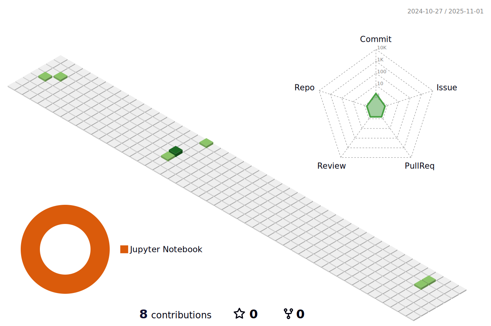

## Hello :wave:
My name is Aaron Vo. I'm an experienced developer :keyboard:, who's a code-slinging movie buff :movie_camera:, video game  enthusiast :video_game:, and a former Star Wars fan (Yes, it's been a long, long journey to a far, far away galaxy with this one). The Force is still with me of course, but these days it’s more of a tickle than a full-on [Vader force choke](https://www.youtube.com/watch?v=6p4T7_XI7WM). When I'm not busy scrummaging the mess that is my machine learning code, I like to take photos on my way-too-expensive camera and embark on many jet-setting adventures all over the world. 
###

Here are the top 5 places I have visited: 
1. Barcelona
2. London
3. Ireland
4. Osaka
5. Tokyo

##
#### Some Stats!

